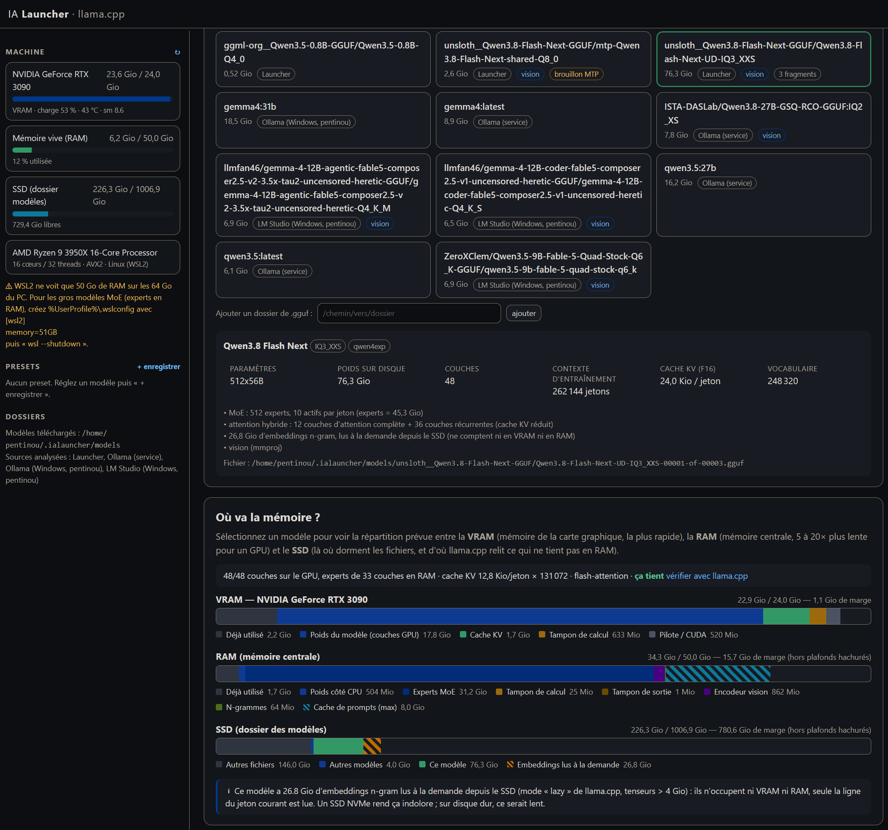
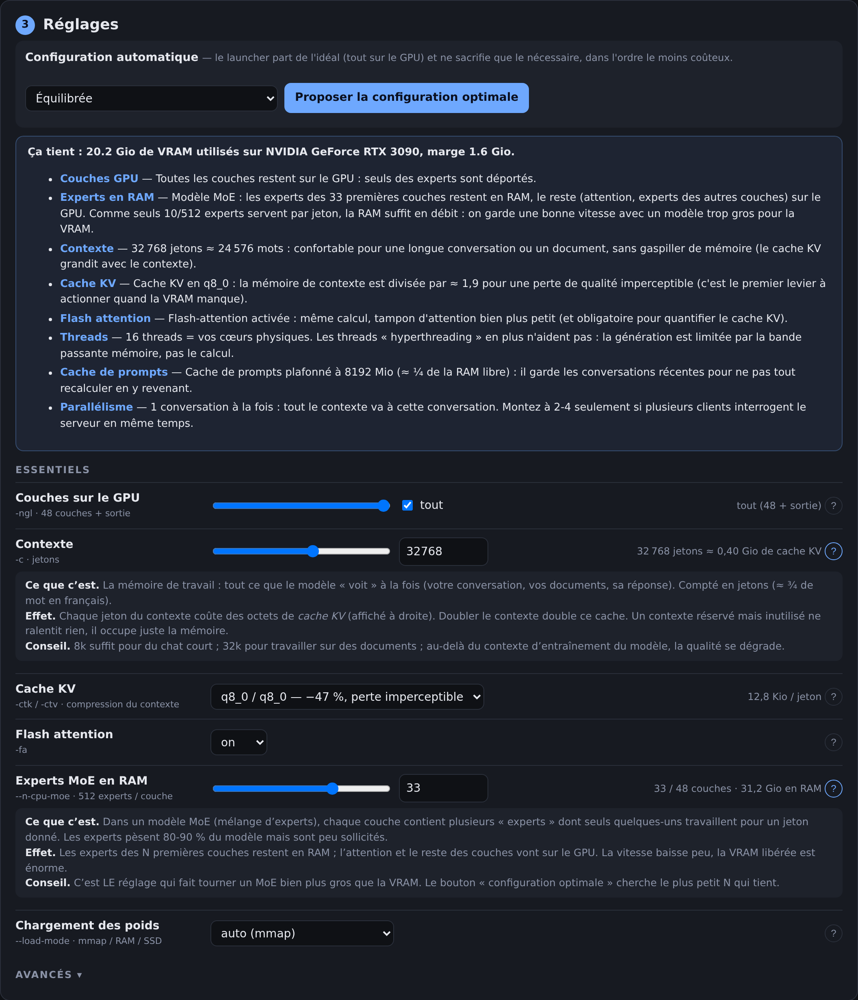
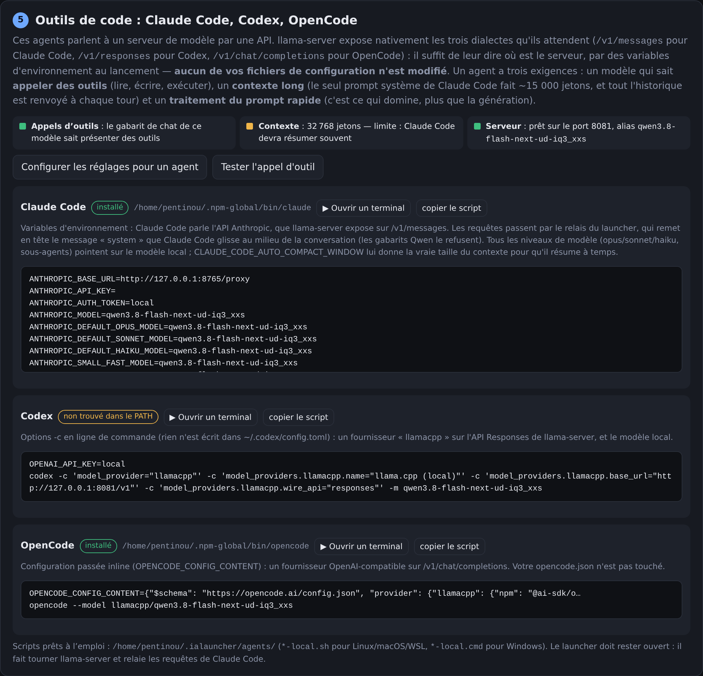

# IA Launcher

Un lanceur d'IA locales **didactique** : il installe le moteur ([llama.cpp](https://github.com/ggml-org/llama.cpp)),
propose des modèles, **montre où va la mémoire** (VRAM / RAM / SSD) à mesure que vous
changez les réglages, propose une **configuration optimale pour votre machine** et lance
le serveur — avec un petit chat pour vérifier que tout répond, et de quoi brancher
**Claude Code, Codex ou OpenCode** sur le modèle local.

Python 3.10+ **sans aucune dépendance** (bibliothèque standard uniquement). Interface web
vanilla (HTML/JS/CSS), servie uniquement sur `127.0.0.1`. Linux, WSL2, Windows, macOS.

```bash
git clone https://github.com/pentinou/ialauncher.git
cd ialauncher
python3 ialauncher.py          # ouvre http://127.0.0.1:8765 dans le navigateur
```



Inspiré d'[ajean](https://github.com/nathaninline/ajean) (Go) pour l'organisation
générale ; le code est indépendant.

## Sommaire

- [Pourquoi ce projet](#pourquoi-ce-projet)
- [Prérequis](#prérequis)
- [Installation et démarrage](#installation-et-démarrage)
- [Ce que fait chaque étape](#ce-que-fait-chaque-étape)
- [Utiliser le modèle depuis d'autres applications](#utiliser-le-modèle-depuis-dautres-applications)
- [Configurations enregistrées (presets)](#configurations-enregistrées-presets)
- [Où sont les fichiers](#où-sont-les-fichiers)
- [Précision de l'estimation](#précision-de-lestimation)
- [Exemple : Qwen 3.8 Flash Next sur 24 Go de VRAM](#exemple--qwen-38-flash-next-sur-24-go-de-vram--64-go-de-ram)
- [Agents de code : testé](#agents-de-code--testé)
- [Dépannage](#dépannage)
- [Limites connues](#limites-connues)
- [Structure du code](#structure-du-code)
- [API HTTP du launcher](#api-http-du-launcher)
- [Désinstallation](#désinstallation)
- [Licence](#licence)

## Pourquoi ce projet

Faire tourner un modèle de langage chez soi, c'est surtout une question de **mémoire** :
où mettre les poids, combien coûte le contexte, que sacrifier quand ça ne tient pas.
Les outils grand public (Ollama, LM Studio) cachent ces choix ; llama.cpp les expose
tous (`-ngl`, `--n-cpu-moe`, `-ctk/-ctv`, `-c`, `-fa`, décodage spéculatif…) mais sans
dire ce qu'ils coûtent. IA Launcher se place entre les deux : **chaque réglage est
expliqué, et son effet sur la mémoire est visible avant de lancer**.

Ce que le launcher ne fait pas (volontairement) : pas de mémoire de conversation, pas
d'outils/MCP, pas de gestion multi-utilisateurs. C'est un lanceur, pas une plateforme.

## Prérequis

| | Obligatoire | Pour le moteur GPU |
|---|---|---|
| **Tous** | Python ≥ 3.10, un navigateur, connexion internet (Hugging Face, GitHub) | — |
| **Windows** | — | Pilote NVIDIA à jour (binaire CUDA officiel), sinon Vulkan (AMD/Intel/NVIDIA) |
| **macOS** | — | Rien : le binaire officiel utilise Metal |
| **Linux + NVIDIA** | — | Il n'existe **pas de binaire CUDA officiel** : le launcher compile llama.cpp. Il faut `cmake`, `g++` (ou `clang++`) et le CUDA Toolkit (`nvcc`, cherché dans le PATH ou `/usr/local/cuda/bin`). Sans ces outils, il propose le binaire Vulkan. |
| **Linux + AMD** | — | Runtime ROCm installé (binaire ROCm officiel), sinon Vulkan |
| **WSL2 + NVIDIA** | — | Comme Linux + NVIDIA : **compilez en CUDA** (les builds Vulkan ne voient pas le GPU sous WSL2) |

Sur Debian/Ubuntu, pour la compilation CUDA :

```bash
sudo apt install cmake g++ cuda-toolkit    # cuda-toolkit depuis le dépôt NVIDIA
```

Pas de GPU ? Tout fonctionne sur CPU ; les petits modèles (≤ 4-8 milliards de
paramètres, quantifiés en Q4) restent utilisables.

## Installation et démarrage

```bash
git clone https://github.com/pentinou/ialauncher.git
cd ialauncher
python3 ialauncher.py
```

Aucun `pip install`. Sous Windows, `py ialauncher.py` ou `python ialauncher.py`.

Pour **mettre à jour puis lancer** en une commande (Linux, macOS, WSL2) :

```bash
./start.sh                     # git pull, moteur llama.cpp si une release plus récente existe, lancement
```

`start.sh` accepte les mêmes options qu'`ialauncher.py`. Le moteur est réinstallé par la
méthode d'origine (recompilation CUDA ou binaire officiel) et l'ancienne version reste
dans `engines/`. Une mise à jour qui échoue (hors ligne, modifications locales…) est
signalée et n'empêche pas le lancement.

Options :

```
python3 ialauncher.py --port 9000     # port de l'interface (défaut 8765 ; si occupé, le suivant libre)
python3 ialauncher.py --no-browser    # ne pas ouvrir le navigateur
IALAUNCHER_HOME=/data/ia python3 ialauncher.py   # changer le dossier de données (voir plus bas)
```

`Ctrl+C` (ou `SIGTERM`) arrête le launcher **et** le `llama-server` qu'il a lancé. Si un
`llama-server` d'une session précédente traîne encore (fichier PID), il est arrêté au
démarrage suivant.

Au premier lancement, suivez les onglets dans l'ordre : **Moteur → Modèle → Réglages →
Lancer → Chat**. Chaque écran explique ce qu'il fait ; les boutons « ? » détaillent
chaque réglage.

## Ce que fait chaque étape

1. **Moteur** — détecte GPU / OS et propose la bonne façon d'obtenir `llama-server` :
   binaires officiels précompilés (Windows CUDA/Vulkan/CPU, macOS Metal, Linux
   Vulkan/ROCm/CPU) ou compilation locale CUDA (Linux + NVIDIA, si `nvcc` et `cmake`
   sont présents — il n'existe pas de binaire CUDA officiel pour Linux). On peut aussi
   pointer un `llama-server` déjà installé. La version prise est la dernière release
   stable de llama.cpp ; la compilation produit aussi `llama-fit-params` (voir étape 4).
2. **Modèle** — liste les `.gguf` déjà sur le disque (dossier du launcher, Ollama, LM
   Studio, dossiers ajoutés), un catalogue commenté de modèles conseillés (Qwen 3.5/3.6/3.8,
   Gemma 4, gpt-oss, GLM… uniquement depuis des quantiseurs reconnus : unsloth, ggml-org,
   bartowski), et la recherche Hugging Face (dépôts GGUF = versions quantifiées prêtes pour
   llama.cpp). L'en-tête GGUF est lu **à distance** (quelques Mo par fragment) : les
   estimations et la configuration fonctionnent avant même de télécharger. Dans un dépôt,
   **« Analyser les versions pour ma machine »** profile chaque quantification, de la plus
   petite à la plus grosse, et dit laquelle est la meilleure qui tienne (tout en VRAM,
   experts en RAM, ou pas du tout). Les fichiers `mmproj` (vision/audio) et les brouillons
   MTP publiés à part (décodage spéculatif) sont proposés au téléchargement et activés
   automatiquement. Les téléchargements sont **reprenables** (fichier `.part` + `Range`).
3. **Réglages** — chaque réglage a un bouton « ? » qui explique ce qu'il fait, son
   effet sur la mémoire, la vitesse et la qualité. « Proposer la configuration
   optimale » part de l'idéal (tout sur le GPU, cache KV en f16, contexte 32k) et ne
   sacrifie que le nécessaire, dans l'ordre le moins coûteux : cache KV en q8_0, contexte
   (jusqu'à 8k), experts MoE déportés en RAM (`--n-cpu-moe`), puis couches sur CPU
   (`-ngl`), et en dernier recours tout sur CPU. Un champ « options supplémentaires »
   permet de passer n'importe quelle option de `llama-server`.

   

4. **Où va la mémoire ?** — trois jauges (VRAM par carte, RAM, SSD) découpées en
   segments : poids sur GPU, cache KV, tampon de calcul, pilote, poids côté CPU, experts
   en RAM, cache de prompts, tenseurs lus à la demande, poids relus depuis le SSD faute
   de RAM… Les avertissements disent quoi faire quand ça ne tient pas. Le bouton
   « vérifier avec llama.cpp » demande un second avis à `llama-fit-params` (projection
   en ~1,5 s sans charger les poids).
5. **Lancer** — affiche la commande `llama-server` exacte (copiable, pour la relancer à
   la main), lance le serveur, puis compare **prévu vs réel** en lisant les tailles de
   tampons dans le journal (`logs/llama-server.log`). Le port demandé est 8080 ; s'il est
   pris, le launcher prend le suivant libre et l'affiche.
6. **Outils de code** — branche **Claude Code, Codex ou OpenCode** sur le modèle local.
   llama-server expose nativement `/v1/messages` (API Anthropic), `/v1/responses` (API
   Responses) et `/v1/chat/completions` : chaque outil reçoit ses réglages au lancement
   (variables d'environnement, options `-c`, config inline), sans toucher à vos fichiers
   de configuration. Le launcher vérifie que le modèle sait appeler des outils (bouton de
   test), propose des réglages « agent » (≥ 64k de contexte, KV q8_0, `--cache-reuse`) et
   génère des scripts `~/.ialauncher/agents/*-local.sh|.cmd` à relancer plus tard sans
   passer par l'interface. Les requêtes de Claude Code passent par un relais du launcher
   (`/proxy/…`) qui remet en tête le message « system » qu'il glisse au milieu de la
   conversation — les gabarits Qwen le refusent sinon.

   

7. **Chat** — flux avec raisonnement replié, tok/s. Sert à vérifier que le serveur
   répond ; ce n'est pas un client de chat complet.

## Utiliser le modèle depuis d'autres applications

Une fois lancé, `llama-server` est un serveur HTTP ordinaire compatible **OpenAI**
(`http://127.0.0.1:8080` par défaut, le port réel est affiché dans l'onglet Lancer).
Tout client qui parle l'API OpenAI s'y branche : Open WebUI, Continue, Cline, Jan,
scripts Python avec le paquet `openai`… La clé API est ignorée (mettez n'importe quoi).

```bash
curl http://127.0.0.1:8080/v1/chat/completions -H 'Content-Type: application/json' \
  -d '{"messages":[{"role":"user","content":"Bonjour"}]}'
```

Endpoints utiles : `/v1/chat/completions`, `/v1/completions`, `/v1/messages`
(Anthropic), `/v1/responses`, `/health`, `/props`, et l'interface web intégrée de
llama.cpp sur `/`.

Par défaut le serveur n'écoute que sur `127.0.0.1`. Pour l'exposer sur le réseau local,
ajoutez `--host 0.0.0.0` (et de préférence `--api-key …`) dans les « options
supplémentaires » des réglages — sans clé, n'importe qui sur le réseau peut l'utiliser.

## Configurations enregistrées (presets)

Un preset = un modèle + ses réglages, sauvegardé dans `presets/<nom>.json`. Enregistrez
depuis l'onglet Réglages, rechargez d'un clic. Les fichiers sont du JSON lisible, on
peut les copier d'une machine à l'autre (les chemins de modèles doivent exister).

## Où sont les fichiers

`~/.ialauncher` (Linux/macOS) ou `%LOCALAPPDATA%\ialauncher` (Windows), modifiable par
la variable `IALAUNCHER_HOME` :

```
engines/   binaires llama.cpp (un sous-dossier par version/variante, fichier VERSION)
models/    .gguf téléchargés par le launcher (+ mmproj, brouillons MTP)
presets/   configurations enregistrées (JSON)
agents/    scripts générés pour Claude Code / Codex / OpenCode
cache/     en-têtes GGUF déjà lus, catalogue Hugging Face, sources llama.cpp
logs/      llama-server.log (sortie du dernier serveur lancé)
config.json   moteur choisi, dossiers de modèles ajoutés
```

Les modèles trouvés dans les dossiers d'**Ollama** (`~/.ollama/models`,
`/usr/share/ollama/.ollama/models`, et les profils Windows vus depuis WSL) et de
**LM Studio** (`~/.lmstudio/models`, `~/.cache/lm-studio/models`) sont utilisés en place,
jamais copiés. On peut ajouter n'importe quel autre dossier depuis l'onglet Modèle.

## Précision de l'estimation

L'estimateur reprend les règles de llama.cpp (placement des couches, cache KV par type
de couche — attention complète, fenêtre glissante, récurrente —, tampons calibrés sur
la projection de `--fit`). Sur les modèles testés il est à ± 3 % des tailles réelles
pour les poids et le cache KV ; le tampon de calcul est volontairement prudent (le
tampon réellement réservé recycle ses intermédiaires).

En résumé, ce qui est compté :

| Segment | Calcul |
|---|---|
| Poids par couche | offsets exacts lus dans l'en-tête GGUF |
| Cache KV | `ctx × Σ(n_head_kv × key_len × octets)` sur les couches d'attention seulement (les couches récurrentes/SWA coûtent beaucoup moins) |
| Tampon de calcul | ≈ `ubatch × (n_vocab + 4·n_embd) × 4` (+ `ubatch × ctx × n_head × 4` sans flash-attention) |
| Surcoût CUDA | ≈ 520 Mio par carte (contexte + pilote) |
| Tenseurs « lazy » | embeddings par couche (Gemma E4B, Qwen Flash Next) lus à la demande sur le SSD : comptés sur la jauge SSD, pas en RAM |

## Exemple : Qwen 3.8 Flash Next sur 24 Go de VRAM + 64 Go de RAM

Ce modèle (125B, 6B actifs) embarque **51B d'embeddings n-gram** (26,8 Gio dans tous
les GGUF) que llama.cpp lit **à la demande depuis le SSD** (mode lazy) : ils ne
comptent ni en VRAM ni en RAM. Ce qui doit être résident, ce sont les experts (26 à
55 Gio selon la quantification) et l'attention (~3-4 Gio). Le launcher place
l'attention et une partie des experts sur le GPU, le reste des experts en RAM
(`--n-cpu-moe`) :

| Version | Experts | RAM nécessaire | Verdict (RTX 3090 + 31 Go WSL / 48 Go / 64 Go natif) |
|---|---|---|---|
| REAP-256 UD-Q3_K_XL (experts élagués) | 26 Gio | 14 Gio | ✅ / ✅ / ✅ |
| unsloth UD-IQ1_S | 37 Gio | 24 Gio | ✅ (juste) / ✅ / ✅ |
| unsloth UD-Q2_K_XL | 43 Gio | 30 Gio | ❌ / ✅ / ✅ |
| unsloth UD-IQ4_XS | 55 Gio | 41 Gio | ❌ / ❌ / ✅ |

Sous WSL2, la RAM vue par défaut est la moitié du PC : `%UserProfile%\.wslconfig`
avec `[wsl2]` / `memory=51GB` puis `wsl --shutdown` (le launcher le signale).

## Agents de code : testé

Avec Qwen 3.8 27B (IQ2_XXS) en contexte 131k sur la RTX 3090 : Claude Code (`claude -p`)
lit un fichier avec l'outil `Read` et répond en 26 s (dont ~20 s pour ingérer son prompt
système de ~15k jetons la première fois) ; OpenCode répond via la config inline. Codex
n'a pas pu être testé ici (non installé) : la commande générée suit le format documenté.

Ce que fait chaque script généré :

- **Claude Code** : `ANTHROPIC_BASE_URL` pointe sur le relais du launcher,
  `ANTHROPIC_AUTH_TOKEN` factice, `ANTHROPIC_MODEL` / `ANTHROPIC_DEFAULT_*_MODEL` /
  `CLAUDE_CODE_SUBAGENT_MODEL` sur le modèle local, `CLAUDE_CODE_AUTO_COMPACT_WINDOW`
  aligné sur le contexte.
- **Codex** : `codex -c model_provider=… -c model_providers.<x>.base_url=… -c
  model_providers.<x>.wire_api="responses"` + `OPENAI_API_KEY` factice.
- **OpenCode** : configuration inline via `OPENCODE_CONFIG_CONTENT`.

Rien n'est écrit dans `~/.claude`, `~/.codex` ou `~/.config/opencode`.

## Dépannage

| Symptôme | Cause / remède |
|---|---|
| « port 8765 occupé » au démarrage | Une autre instance tourne, ou le port est pris : le launcher bascule sur le suivant et l'affiche. |
| Le GPU n'est pas détecté sous WSL2 | Vous avez un binaire Vulkan : compilez en CUDA (onglet Moteur → « compiler »). Installez d'abord `cuda-toolkit`, `cmake`, `g++`. |
| La VRAM « déjà utilisée » est élevée alors que rien ne tourne | Sous WSL2, `nvidia-smi` compte l'usage de Windows (bureau, navigateur…). Le launcher prend la valeur la plus prudente entre `nvidia-smi` et `llama-server --list-devices`. |
| La RAM affichée est la moitié de celle du PC | WSL2 ne donne que 50 % par défaut : `%UserProfile%\.wslconfig` → `[wsl2]` / `memory=…GB`, puis `wsl --shutdown`. |
| « wrong number of tensors » au chargement d'un blob Ollama | Le blob embarque un encodeur vision/audio dans le même fichier (gemma4, qwen3.5 du registre Ollama) : llama.cpp officiel ne sait pas le lire. Téléchargez le GGUF depuis Hugging Face. |
| Un modèle « tient » d'après les jauges mais le serveur échoue | Cliquez « vérifier avec llama.cpp » (`llama-fit-params`) et lisez `logs/llama-server.log` ; le tampon de calcul dépend de `-ub` (ubatch) : réduisez-le. |
| Claude Code : « System message must be at the beginning » | Lancez Claude Code via le script généré (il passe par `/proxy/`), pas directement sur le port de llama-server. |
| Réponses très lentes avec un MoE | Trop d'experts en RAM (`--n-cpu-moe`) ou trop de couches sur CPU : essayez une quantification plus petite, KV q8_0, ou un contexte réduit pour remonter des couches sur le GPU. |

## Limites connues

- Les blobs Ollama qui embarquent un encodeur vision/audio dans le même fichier
  (`gemma4`, `qwen3.5` du registre Ollama) ne sont pas chargeables par llama.cpp
  officiel : le launcher le signale ; les blobs texte seul (et leur projecteur séparé)
  fonctionnent.
- Sous WSL2, la VRAM « déjà utilisée » vue par `nvidia-smi` inclut l'usage Windows ;
  la RAM affichée est celle allouée à WSL (`.wslconfig`).
- Les builds Vulkan ne voient généralement pas le GPU sous WSL2 : compilez en CUDA.
- Détection GPU : NVIDIA via `nvidia-smi`, AMD via sysfs (Linux), Apple via la mémoire
  unifiée. Un GPU Intel ou AMD sous Windows n'est pas listé (le moteur Vulkan l'utilise
  quand même, mais sans jauge VRAM).
- Un seul `llama-server` à la fois.
- Interface et explications en français uniquement.

## Structure du code

```
ialauncher.py          point d'entrée (argparse, lance web.serve)
start.sh               mise à jour (git pull, moteur llama.cpp) puis lancement
launcher/
  web.py               serveur HTTP (ThreadingHTTPServer), routes /api/*, relais /proxy/*
  hardware.py          inventaire GPU / RAM / CPU / disque (nvidia-smi, sysfs, /proc, sysctl, ctypes)
  engine.py            obtention de llama-server : prebuilt (releases GitHub), build CUDA, custom
  download.py          HTTP (JSON, Range, téléchargement reprenable)
  gguf.py              lecteur d'en-tête GGUF (local ou à distance par Range)
  models.py            inventaire des .gguf (launcher, Ollama, LM Studio, dossiers ajoutés), Hugging Face
  catalog.py           catalogue statique de modèles conseillés
  profile.py           profil d'un modèle : architecture, couches, experts, tenseurs lazy
  estimate.py          estimation mémoire par segment (VRAM / RAM / SSD) pour une config
  recommend.py         configuration optimale pour la machine (ordre des sacrifices)
  server.py            cycle de vie de llama-server : ligne de commande, démarrage, journal, PID
  agents.py            scripts et relais pour Claude Code / Codex / OpenCode
  jobs.py              tâches longues (téléchargement, compilation) avec progression
  presets.py           presets JSON
  paths.py             dossiers de données (IALAUNCHER_HOME)
ui/
  index.html, app.js, style.css   interface, sans framework ni build
```

Pour vérifier l'inventaire matériel seul : `python3 -m launcher.hardware`.

## API HTTP du launcher

L'interface web n'utilise que ces routes (JSON), utilisables aussi en script :

| Méthode | Route | Rôle |
|---|---|---|
| GET | `/api/hardware`, `/api/live` | inventaire matériel ; valeurs qui bougent (VRAM, RAM, disque) |
| GET/POST | `/api/engine`, `/api/engine/install`, `/api/engine/custom`, `/api/engine/select` | état et installation du moteur |
| GET/POST | `/api/jobs`, `/api/jobs/<id>`, `/api/jobs/<id>/cancel` | tâches longues |
| GET/POST | `/api/models`, `/api/models/profile`, `/api/models/dirs` | modèles locaux, profil, dossiers |
| GET/POST | `/api/catalog`, `/api/hf/search`, `/api/hf/repo`, `/api/hf/profile`, `/api/hf/download`, `/api/hf/analyze` | catalogue et Hugging Face |
| POST | `/api/estimate`, `/api/recommend`, `/api/fit`, `/api/cmdline` | estimation, config optimale, second avis llama-fit-params, ligne de commande |
| GET/POST | `/api/presets`, `/api/presets/delete` | presets |
| GET/POST | `/api/server`, `/api/server/start`, `/api/server/stop` | llama-server |
| POST | `/api/chat` | chat de test (flux) |
| GET/POST | `/api/agents`, `/api/agents/test`, `/api/agents/scripts`, `/api/agents/open` | outils de code |
| * | `/proxy/…` | relais vers llama-server (normalise les messages Anthropic) |

## Désinstallation

Supprimez le dossier du dépôt et le dossier de données (`~/.ialauncher` ou
`%LOCALAPPDATA%\ialauncher`, ou `IALAUNCHER_HOME`). Rien d'autre n'est écrit sur la
machine ; les modèles Ollama / LM Studio ne sont pas touchés.

## Licence

[MIT](LICENSE).
